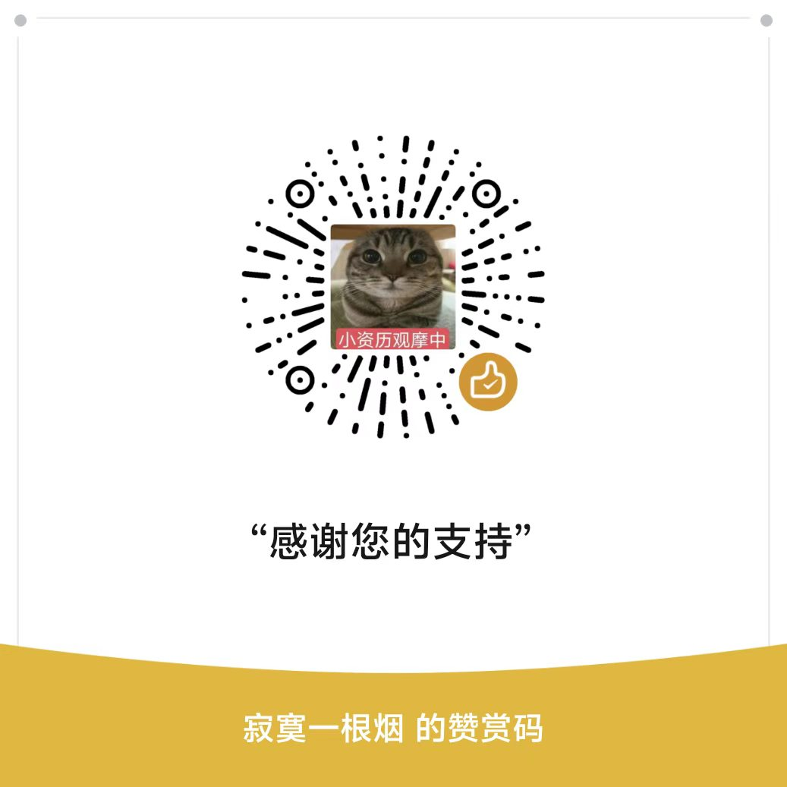

# BlackRain Desktop

> 开源版 Codex Desktop——基于原装 `codex-rs` / `codex app-server`，但对模型开放。

[](https://github.com/goodbyeri-studio/blackrain-desktop/actions/workflows/ci.yml)
[](LICENSE)

> 当前以 macOS 为唯一产品发布目标。Electron 代码和自动化检查存在，不等于已发布、已签名或已公证的 macOS 产品。

## 目标

BlackRain 的桌面能力对标官方 Codex Desktop，但**对模型开放**。

**基线：完整的 Codex 桌面体验。** Codex thread、审批、停止与恢复、标准 Codex Home（与原生 CLI 共享配置、认证和可恢复 thread）、文件、终端、Git、diff、通知，以及 main-owned in-app Browser 和 Computer Use。

**差异化：开放的模型层。** 官方 Codex Desktop 绑定官方模型，BlackRain 不绑定：

- **多模型 Provider**——接入任意第三方模型，自带 key 即可用；
- **Auto Router**——按任务自动选模型，类似 Cursor 的多模型调度；
- **可选 credit**——不想自己管 key 的用户可以用托管额度，但它是便利选项，不是准入门槛。

模型层不改变 Codex 内核：`codex-rs` / `codex app-server` 仍是唯一 agent runtime，thread、turn、审批和持久化仍由 app-server 拥有。

> 模型层的当前状态是 `CODE_EXISTS`——协议翻译 sidecar 与设置 UI 已有代码，宿主 API 尚未接线，因此**在当前构建里还不可用**。进度以 [产品定义](docs/product.md) 为准。

## 快速开始

需要 macOS、Node.js 22 和 Git。Electron 发行脚本仍在从历史 Windows 配置迁移中；不要把现有打包命令视作 macOS 发行流程。

```sh
cd apps/desktop
npm ci
npm run electron:start
```

**自带 key 即可用。** fork 或 clone 本仓后不需要任何账号或后端配置：应用内的账号 UI 是可选的，未配置时直接放行、不拦截使用。

完整命令、测试与发布边界见[开发文档](docs/development.md)。

## 文档

[文档地图](docs/README.md) · [产品定义](docs/product.md) · [架构](docs/architecture.md) · [Browser 与 Computer Use](docs/browser.md) · [上游与来源](docs/upstream.md)

## 参与贡献

阅读 [CONTRIBUTING.md](CONTRIBUTING.md)，从 [Issue #95](https://github.com/goodbyeri-studio/blackrain-desktop/issues/95) 或 [Good first issue](https://github.com/goodbyeri-studio/blackrain-desktop/issues?q=is%3Aissue+is%3Aopen+label%3A%22good+first+issue%22) 开始。

## 联系与支持

- 项目联系：[goodbyeri-studio](https://github.com/goodbyeri-studio)，或扫描下方微信二维码。
- 赞赏支持：扫描下方赞赏码。赞赏是自愿的，不构成支持承诺或服务等级协议。

<table>
  <tr>
    <td align="center">微信联系方式<br></td>
    <td align="center">赞赏支持<br></td>
  </tr>
</table>

## 许可证

BlackRain 自有代码采用 [MIT](LICENSE)，第三方归属见 [NOTICE](NOTICE)。项目独立于 OpenAI、ChatGPT 和 Cursor，不复制其闭源代码或专有资源。
